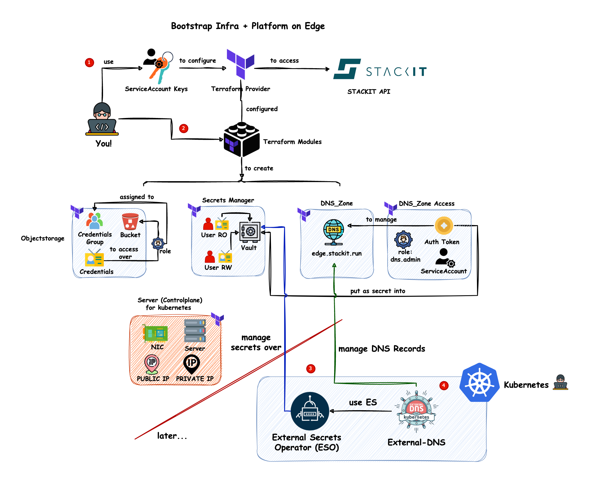
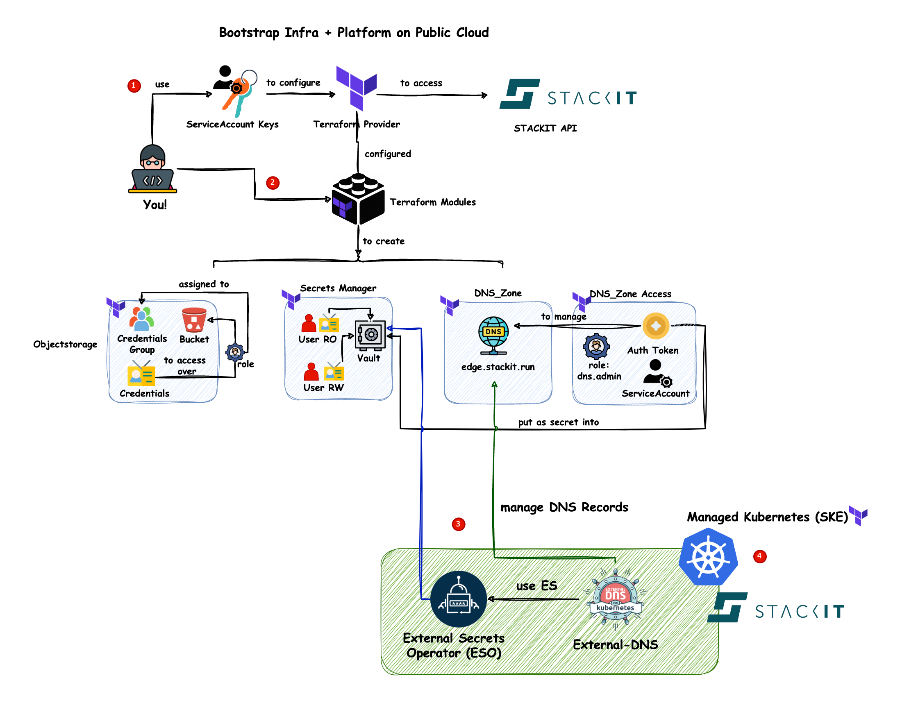

# Terraform Platform Provisioning – STACKIT Cloud (Edge & Public)

> ⚙️ This setup is powered by [`kubara`](https://kubara.git.onstackit.cloud/STACKIT/kubara/wiki), which generates cluster-specific Terraform configurations from reusable module templates. You define your intent, `kubara` does the heavy lifting. If you are reading this README, you are likely using the `kubara` CLI to bootstrap your Kubernetes clusters or someone else has already done it for you.

---

## 📦 What You Get

Provision fully-featured Kubernetes environments on STACKIT – Edge or Public Cloud – using opinionated, production-grade Terraform modules.

- ✨ Modular, reusable Terraform setup
- 🔄 Dynamically generated config via `kubara`
- 🧩 One config file per cluster: `env.auto.tfvars`
- 🚫 No manual module editing required
- ✅ Argo CD-ready, SSO-ready, DNS, Vault, IAM & more

---

## 🧱 Folder Structure

The whole folder structure is generated by `kubara` and looks like this:

```
customer-service-catalog/
└── terraform/
    └── <CLUSTERNAME>/
        ├── bootstrap-tfstate-backend/
        └── infrastructure/
            ├── env.auto.tfvars     # 🔧 Adjust this file, if you need
            ├── main.tf
            ├── variables.tf
            ├── terraform.tf
            └── set-env.sh/.ps1
managed-service-catalog/
└── terraform/
    └── modules/                   # Reusable Terraform modules
```

> 💡 Want to create a new cluster? Don’t copy folders manually. Use:
>
> ```bash
> kubara --terraform
> ```

---

## 🛠️ Prerequisites

Make sure you have:

1. Access to the [STACKIT Cloud Portal](https://portal.stackit.cloud)
2. A valid **Service Account** (incl. project permissions)
3. Terraform v1.9 or newer
4. The `kubara` CLI installed
5. (Optional) `jq` for handling JSON output

---

## 🔐 Step 1 – Authentication Setup

Start by duplicating the helper script:

```bash
cp set-env-changeme.sh set-env.sh
vim set-env.sh
```

Or on Windows:

```powershell
cp set-env-changeme.ps1 set-env.ps1
notepad set-env.ps1
```

Add your STACKIT credentials (SERVICE_ACCOUNT_KEY authentication is reccomended):

```bash
export STACKIT_SERVICE_ACCOUNT_KEY_PATH="/path/to/your-service-account.json"
export STACKIT_PRIVATE_KEY_PATH="/path/to/private-key.pem"
```

You’ll add `AWS_ACCESS_KEY_ID` and `AWS_SECRET_ACCESS_KEY` later (after the s3-bucket that stores terraform state is created).<br>
If you want to use an existing s3-bucket that you control,
you can set the vars accordingly and skip the Step "Create Remote State Backend".<br>
Consider the security implications regarding sensitive values in terraform state before using an existing s3-bucket.

Then run:

```bash
source set-env.sh      # or . .\set-env.ps1 on PowerShell
```

---

## 🚀 Step 2 – Generate Cluster Templates (No need, just for new Cluster)

Create a new cluster setup using `kubara`:

```bash
kubara --terraform
```

Based on your `config.yaml` and if you are setting by `kubernetesType`, this generates a pre-wired Terraform folder for edge oder cloud (SKE):

- Includes `main.tf`, `variables.tf`, and `terraform.tf`
- Generates a ready-to-edit `env.auto.tfvars`

📁 All configuration goes into that one file.

---

## ⚙️ Step 3 – Edit `env.auto.tfvars`

This file contains all inputs for your cluster. Here’s an example:

```hcl
### DNS
contact_email           = "hello@demo.io
dns_name                = "demo.stackit.run"

### Global
project_id              = "38867e..."
stage                   = "prod"
name                    = "demo"


### Secret Manager / Vault Users
 users = [
        {
            description   = "vault-user-rw"
            write_enabled = true
        },
        {
            description   = "vault-user-ro"
            write_enabled = false
        }
    ]

### Kubernetes

### SKE
kubernetes_version_min = "1.32.5"
node_pools = [
        {
            availability_zones = ["eu01-2"]
            machine_type       = "c1.5"
            maximum            = 4
            minimum            = 2
            name               = "pool-infra"
            os_version_min     = "4152.2.3"
            labels = {
                "project" = "public-cloud-demo"
                "role"    = "infra"
            }
            taints = []
        }
    ]


```

> 💡 `env.auto.tfvars` is generated by `kubara`, but feel free to add more supported variables to match your infrastructure requirements.

---

## ☁️ Step 4 – Create Remote State Backend

Navigate to:

```bash
cd customer-service-catalog/terraform/<CLUSTERNAME>/bootstrap-tfstate-backend
```

Run:

```bash
terraform init
terraform apply
```

Export the remote state credentials:

```bash
export AWS_ACCESS_KEY_ID="..."
export AWS_SECRET_ACCESS_KEY="..."
```

Then re-source your environment:

```bash
source ../infrastructure/set-env.sh
```

---

## 🏗️ Step 5 – Apply Infrastructure

Go to the infrastructure directory:

```bash
cd ../infrastructure
```

Then:

```bash
terraform init
terraform plan
terraform apply
```

🎉 This provisions everything:

- Kubernetes (Edge or Public)
- DNS zone
- IAM roles
- Vault (Secrets Manager)
- Secrets in Vault
- Buckets
- Image uploads (optional)
- And more...

---

## 🌐 Visual Overview

### Edge Cloud Architecture



In the picture above you can see what happening behind the scenes and which resources are created. The difference to the following public cloud architecture is that the Edge Cloud uses MetalLB for load balancing and does not require a public IP address. Also you create a server over terraform which be used to deploy the kubernetes cluster through providing or referencing a talos image.

### Public Cloud (SKE) Architecture



In the picture above you can see what happening behind the scenes and which resources are created and how the kubernetes platform components are connected to the managed services.

---

## 🔑 Step 6 – Export Kubeconfig

Extract and save the kubeconfig:

```bash
terraform output -json kubeconfig_raw | jq -r > ~/.kube/<CLUSTERNAME>.yaml
```

Then use it:

```bash
KUBECONFIG=~/.kube/<CLUSTERNAME>.yaml kubectl get nodes
```

---

## 🔗 Resources

- [STACKIT Terraform Provider](https://registry.terraform.io/providers/stackitcloud/stackit/latest)
- [kubara Wiki](https://kubara.git.onstackit.cloud/STACKIT/kubara/wiki)

---

## 💬 Need Help?

Questions, problems, edge cases?
> 👉 Ask in Teams
> 👉 Open a Git issue

You're not doing Terraform alone – neither are we.
